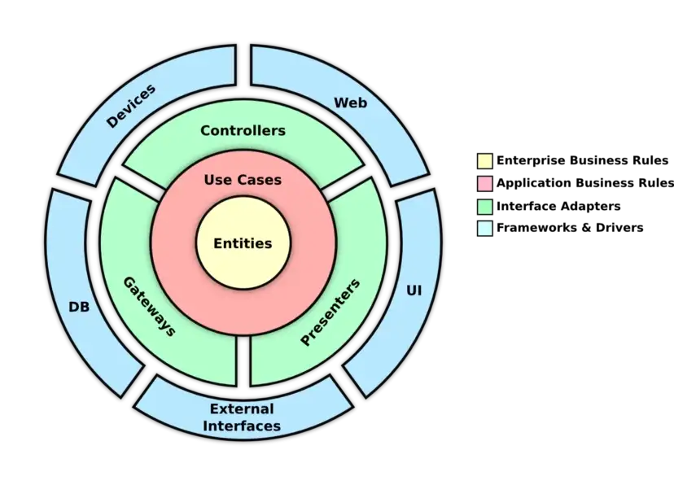
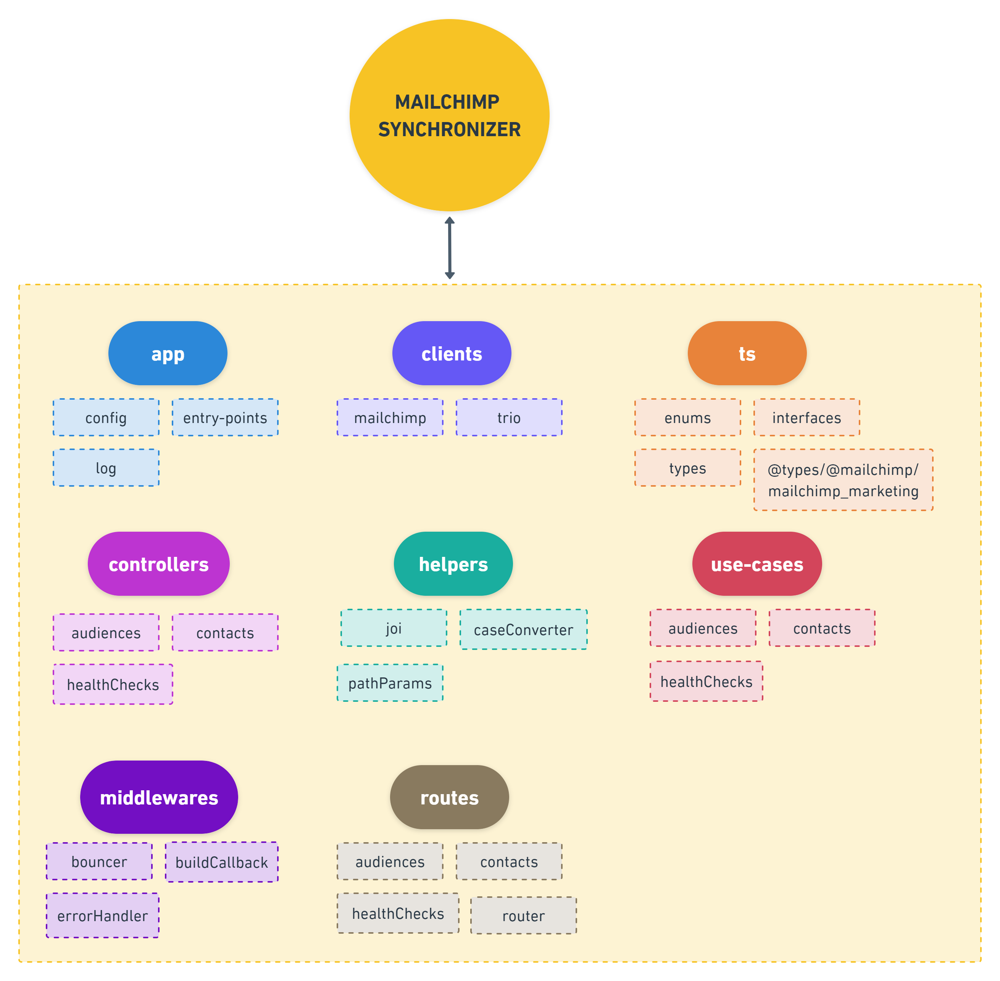
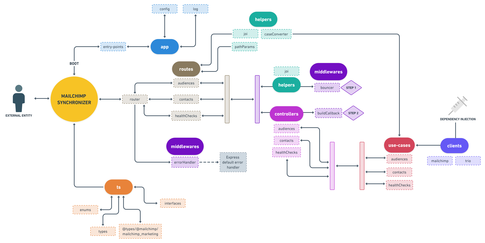

# :monkey: **Mailchimp Synchronizer**


An API dedicated to sync contacts from a Mock API to Mailchimp. Here you'll find the deliverables requested at [**Trio's Back-End Project**](https://trio.notion.site/Back-End-Project-78fa9bd235be48fd82887f73055ae133) and a few extra things!

---

## :mag: **Background**

First of all, this API core consists not only by Node.js, TypeScript and Express.js as described on the badges above, it also implements the notorious **Clean Architecture** (a.k.a Uncle Bob's Style).

Ok, but why? I can't emphasize enough how learning and implementing the **Clean Architecture** has saved and is saving so much time in the development of new features, testability of the system and the general maintenance of their components.

Implementing it requires a little effort in understanding how it works and will also generate a bit more files than usual, but in the end it always pays off!

---

## :broom: **The Clean Architecture** :soap:

Through the year as a Back-End developer, I came to the conclusion that a high quality software, no matter the size, has to be:

- :rocket: Performable

- :wrench: Maintanable

- :mount_fuji: Scalable

- :pill: Testable

- :telescope: Traceable

That being said, the most common extinct is to separate files and classes into components that can change independently without affecting other components. And guess what? This is what **Clean Architecture** is all about!

_"**Clean Architecture** is an architectural style created by Robert C. Martin. It is a set of standards that aims to develop an application that makes it easier to quality code that will perform better, is easy to maintain, and has fewer dependencies as the project grows."_

The image below shows the 4 concentric circles that compose a **Clean Architecture**, how they interact with each other, and their dependencies.

<p align="center">
  
</p>

- :dna: **Entities**

The **Entities** layer lives in the very center of the onion, encapsulating enterprise wide business rules. They are the primary concepts of your business. An **entity** can be:

1. Object with methods
2. Set of data structures and functions
3. Database models and constraints around their attributes

They don't know anything about the outer layers and don't have any dependency. When something external happens, **entities** are the least likely to change. The **entity** circle should not be affected by any operational changes to any application.
  
- :jigsaw: **Use Cases**

The **Use Cases** layer lies outside the **Entities** layer. Define application-specific business rules. They are a set of **Use Cases** or actions taken on top of **Entities** (interactions between **Entities**).

Changes to this layer should not affect the **Entities**. Changes to externalities such as the database, user interface, or frameworks are unlikely to affect this layer.

- :factory: **Interface Adapters**

The **Interface Adapters** layer lies outside the **Use Cases** layer. Holds the Controllers, APIs, Gateways and Presenters. The **Interface Adapters** govern the flow of communication between external components and the system's Back-End. **Interface Adapters** are isolating our various **Use Cases** from the tools that we use. 

An important functionality is to convert data from the format most convenient for the **Use Cases** and **Entities** to the format most convenient for some external agency such as the database or the web. For example, REST Controllers convert the HTTP request’s query and body params into **Use Cases** arguments or Repositories to read the database and convert the results into **Entities**.

- :cd: **Frameworks and Drivers**

The **Frameworks and Drivers** layer lies outside the **Interface Adapters** layer (a.k.a the **Infrastructure Layer**). It is the outermost layer that provides all necessary details about frameworks, drivers, and tools such as Databases that we use to build our application. **Framework and Drivers** are actual external services/components that **Interface Adapters** connect to.

### :yarn: **The Dependency Rule**

The concentric circles represent different areas of a software. In general, the further in you go, the higher level the software becomes. The inner components are defined before the existence of the outer components. Therefore, changes of outer components should not affect inner components.

Do you see the arrows in the image above? They are pointing from the outermost circle down into the innermost circle, they only go in one direction. The dependence flow is represented by the arrows, indicating that:

- :heavy_check_mark: An _**outer ring**_ **can** depend on an _**inner ring**_

- :x: An _**inner ring**_ **can't** depend on an _**outer ring**_

This is what The **Dependency Rule** is all about!

**`TL;DR`** Any software entity (variables, functions, classes, etc) declared in an _**outer circle**_ **must not** be mentioned by the code in an _**inner circle**_.

---

## :milky_way: **Mixing it all up**

Well, every API has it's own universe, right? That being said, there's no perfect formula to implement the **Clean Architecture**. Every code out there trying to implement **Clean Architecture** will have their peculiarities, and it's not different for this API!

Keep in mind that there's no boundary of having just 4 layers. If you find that you may need more than 4, just go on. However, the **Dependency Rule** must always apply.

Based on every **Clean Architecture** concept that was described above, here's how this API was structured:

```
.
│   README.md 
│   ...   
└─── app
│
└─── clients
│   
└─── controllers
│   
└─── helpers
│   
└─── middlewares
│   
└─── routes
│   
└─── ts
│   
└─── use-cases
    ...
```

### :japanese_castle: **Structure diagram**

<p align="center">
  
</p>

- :brain: **app**

  - **config** ➜ Reads and organize **`.env`** file

  - **entry-points** ➜ Boots any entry point. There's currently 1: API entry point, dedicated to HTTP communication. Powered by [**Express.js**](https://www.npmjs.com/package/express)

  - **log** ➜ Application logger. Powered by [**Winston**](https://www.npmjs.com/package/winston)

- :satellite: **clients**

  - **mailchimp** ➜ Communicates with Mailchimp's API. Powered by [**Mailchimp's Client Library**](https://www.npmjs.com/package/@mailchimp/mailchimp_marketing)

  - **trio** ➜ Communicates with Trio's Mock API. Powered by [**Axios**](https://www.npmjs.com/package/axios)

- :eyeglasses: **ts**

  - **enums** ➜ Application TypeScript Enums

  - **interfaces** ➜ Application TypeScript Interfaces

  - **types** ➜ Application TypeScript Types

  - **@types/@mailchimp/mailchimp_marketing** ➜ This is a tricky one. By reading [**Mailchimp's Documentation**](https://mailchimp.com/developer/marketing/docs/fundamentals/) and [**Mailchimp's API Reference**](https://mailchimp.com/developer/marketing/api/) I realized that [**Mailchimp's Client Library**](https://www.npmjs.com/package/@mailchimp/mailchimp_marketing) and [**Mailchimp's Client Type Definitions**](https://www.npmjs.com/package/@types/mailchimp__mailchimp_marketing) were a must for my TypeScript solution. After downloading both into the application, I noticed something really bad: The **Client Library `3.0.80`** and the **Client Type Definitions `3.0.6`** were **UNSYNCED**. My TypeScript code was being guided by type definitions from a deprecated version of the API, it was **VERY** different from what I was reading at [**Mailchimp's API Reference**](https://mailchimp.com/developer/marketing/api/). So, my workaround was to create my own **Mailchimp's Type Definition** to override the one provided

- :factory: **controllers**

  - **audiences** ➜ Controls the flow between **audiences Routes** and **audiences Use Cases**

  - **contacts** ➜ Controls the flow between **contacts Rotes** and **contacts Use Cases**

  - **healthChecks** ➜ Controls the flow between **healtChecks Routes** and **healthChecks Use Cases**

- :umbrella: **helpers**

  - **joi** ➜ Joi Schemas and Valiators, used at the **bouncer** middleware. Powered by [**Joi**](https://www.npmjs.com/package/joi)

  - **caseConverter** ➜ Object keys converter. Powered by [**snake_case_keys**](https://www.npmjs.com/package/snakecase-keys) and [**camelCaseKeys**](https://www.npmjs.com/package/camelcase-keys). This API pattern is camel case, but [**Mailchimp's Client Library**](https://www.npmjs.com/package/@mailchimp/mailchimp_marketing) follows the snake case pattern. That being said, a converter was essential for me

  - **pathParams** ➜ Just an easy and silly way to maintain a pattern for path params

- :jigsaw: **use-cases**

  - **audiences** ➜ Executes application-specific business rules related to the **`/audiences`** endpoints family, providing [**Dependency Injection**](https://en.wikipedia.org/wiki/Dependency_injection)

  - **contacts** ➜ Executes application-specific business rules related to the **`/contacts`** endpoints family, providing [**Dependency Injection**](https://en.wikipedia.org/wiki/Dependency_injection)

  - **healthChecks** ➜ Executes application-specific business rules related to the **`/health-checks`** endpoints family, providing [**Dependency Injection**](https://en.wikipedia.org/wiki/Dependency_injection)

- :crystal_ball: **middlewares**

  - **bouncer** ➜ [**Express.js**](https://www.npmjs.com/package/express) middleware dedicated to payload validation. Powered by [**Joi**](https://www.npmjs.com/package/joi)

  - **buildCallback** ➜ [**Express.js**](https://www.npmjs.com/package/express) middleware dedicated to control incoming HTTP requests and outgoing HTTP responses. Handle and executes all controllers

  - **errorHanler** ➜ [**Express.js**](https://www.npmjs.com/package/express) middleware dedicated to override Express default error handler. Powered by [**Boom**](https://www.npmjs.com/package/@hapi/boom)

- :world_map: **routes**

  - **audiences** ➜ [**Express.js**](https://www.npmjs.com/package/express) routes for the **`/audiences`** endpoints family. Calls the **bouncer** and **buildCallback** middlewares

  - **contacts** ➜ [**Express.js**](https://www.npmjs.com/package/express) routes for the **`/contacts`** endpoints family. Calls the **bouncer** and **buildCallback** middlewares

  - **healthChecks** ➜ [**Express.js**](https://www.npmjs.com/package/express) routes for the **`/health-checks`** endpoints family. Calls the **bouncer** and **buildCallback** middlewares

  - **router** ➜ [**Express.js**](https://www.npmjs.com/package/express) router for all endpoints families

### :ocean: **Flow diagram**

<p align="center">
  
</p>

---

## :black_joker: **Scripts**

There are a few scripts at **`package.json`**:

- **`api:boot:ts`** ➜ Boots the API **`*.ts`** entry point. Powered by [**TS-Node**](https://www.npmjs.com/package/ts-node)

- **`api:boot:js`** ➜ Boots the API **`*.js`** entry point. Powered by [**Node**](https://nodejs.org/en)

- **`api:boot-watch:ts`** ➜ Boots the API **`*.ts`** entry point and reload it whenever detects file changes. Powered by [**Nodemon**](https://www.npmjs.com/package/nodemon) and [**TS-Node**](https://www.npmjs.com/package/ts-node)

- **`lint`** ➜ Sub-script for **`lint:fix`**. Powered by [**ESLint**](https://www.npmjs.com/package/eslint)

- **`lint:fix`** ➜ Apply application ESLint rules in all files. Powered by [**ESLint**](https://www.npmjs.com/package/eslint)

- **`ts:compile`** ➜ Transpile all **`*.ts`** files to **`*.js`** at outdir **`build`**, while enable color and formatting in TypeScript's output to make compiler errors easier to read. Powered by [**TypeScript**](https://www.npmjs.com/package/typescript)

- **`ts:compile-watch`** ➜ Transpile all **`*.ts`** files to **`*.js`** at outdir **`build`**, while enable color and formatting in TypeScript's output to make compiler errors easier to read and watch input files. Powered by [**TypeScript**](https://www.npmjs.com/package/typescript)

- **`ts:check`** ➜ Compile all **`*.ts`** files to **`*.js`**, but emitting files is disabled

- **`reinstall-modules`** ➜ Delete **`node_modules`** directory and apply **`npm`** clean install

---

## :clipboard: **Endpoints table**

Base URLs:

- **`LOCAL`** ➜ **`http://localhost:3000`**

- **`PRD`** ➜ **`https://mailchimp-synchronizer.herokuapp.com`**

You'll find the endpoints methods, paths and description in the section bellow. The only endpoint required by [**Trio's Back-End Project**](https://trio.notion.site/Back-End-Project-78fa9bd235be48fd82887f73055ae133) was the `/contacts/sync`, the others are extras! Feel free to try out them all.

| Method      | Path                           | Description                                 |
|-------------|--------------------------------|---------------------------------------------|
| **`PATCH`** | **`/audiences/:audienceId`**   | [Update audience](#update-audience)         |
| **`GET`**   | **`/contacts/sync`**           | [Syncs contacts](#syncs-contacts)           |
| **`GET`**   | **`/health-checks`**           | [Ping API](#ping-api)                       |
| **`GET`**   | **`/health-checks/mailchimp`** | [Ping Mailchimp's API](#ping-mailchimp-api) |

---

## :sparkles: **Endpoints glossary**

### <a name="update-audience"></a> **`[PATCH]` Update audience `/audiences/:audienceId`**

- #### **BODY PARAMS**

```typescript
{
    name: string;
    contact: {
        address1: string;
        address2: string | undefined;
        country: ISO3166CountryCode;
        zip: string;
        state: string;
        city: string;
        phone: string | undefined;
        company: string;
    };
    permissionReminder: string;
    campaignDefaults: {
        fromName: string;
        fromEmail: string;
        subject: string;
        language: Language;
    };
    emailTypeOption: boolean;
    useArchiveBar: boolean | undefined;
    notifyOnSubscribe: string | undefined;
    notifyOnUnsubscribe: string | undefined;
    doubleOptin: boolean | undefined;
    marketingPermissions: boolean | undefined;
}
```

- #### **PATH PARAMS**

```typescript
{
    audienceId: string;
}
```

- #### **QUERY PARAMS `None`**

#### **SUCCESS RESPONSE**

- **Code `HTTP 200 OK`**

```typescript
{
    updatedAudience: {
        id: string;
        webId: number;
        name: string;
        contact: {
            company: string;
            address1: string;
            address2: string;
            city: string;
            state: string;
            zip: string;
            country: string;
            phone: string;
        };
        permissionReminder: string;
        useArchiveBar: boolean;
        campaignDefaults: {
            fromName: string;
            fromEmail: string;
            subject: string;
            language: string;
        };
        notifyOnSubscribe: boolean;
        notifyOnUnsubscribe: boolean;
        dateCreated: string;
        listRating: number;
        emailTypeOption: boolean;
        subscribeUrlShort: string;
        subscribeUrlLong: string;
        beamerAddress: string;
        visibility: Visibility;
        doubleOptin: boolean;
        hasWelcome: boolean;
        marketingPermissions: boolean;
        modules: string[];
        stats: {
            memberCount: number;
            totalContacts: number;
            unsubscribeCount: number;
            cleanedCount: number;
            memberCountSinceSend: number;
            unsubscribeCountSinceSend: number;
            cleanedCountSinceSend: number;
            campaignCount: number;
            campaignLastSent: string;
            mergeFieldCount: number;
            avgSubRate: number;
            avgUnsubRate: number;
            targetSubRate: number;
            openRate: number;
            clickRate: number;
            lastSubDate: string;
            lastUnsubDate: string;
        };
        _links: {
            rel: string;
            href: string;
            method: HttpMethod;
            targetSchema: string | undefined;
            schema: string | undefined;
        }[];
    }
}
```

### <a name="syncs-contacts"></a> **`[GET]` Syncs contacts `/contacts/sync`**

- #### **BODY PARAMS `None`**

- #### **PATH PARAMS `None`**

- #### **QUERY PARAMS `None`**

#### **SUCCESS RESPONSE**

- **Code `HTTP 200 OK`**

```typescript
{
    syncedContacts: number;
    contacts: {
        firstName: string;
        lastName: string;
        email: string;
    }[];
}
```

### <a name="ping-api"></a> **`[GET]` Ping API `/health-checks`**

- #### **BODY PARAMS `None`**

- #### **PATH PARAMS `None`**

- #### **QUERY PARAMS `None`**

#### **SUCCESS RESPONSE**

- **Code `HTTP 200 OK`**

```typescript
{
    ok: true;
}
```

### <a name="ping-mailchimp-api"></a> **`[GET]` Ping Mailchimp's API `/health-checks/mailchimp`**

- #### **BODY PARAMS `None`**

- #### **PATH PARAMS `None`**

- #### **QUERY PARAMS `None`**

#### **SUCCESS RESPONSE**

- **Code `HTTP 200 OK`**

```typescript
{
	mailchimpHealthCheck: {
		healthStatus: string;
	};
}
```
