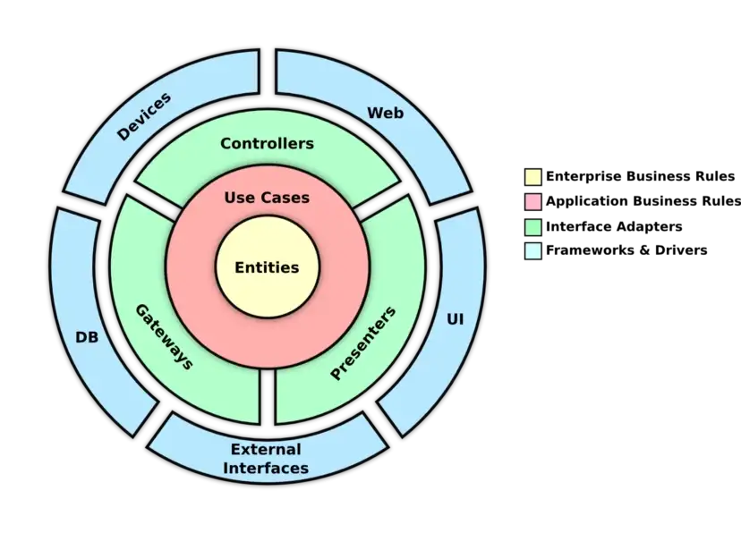

# :monkey: Mailchimp Synchronizer


An API dedicated to syncs contacts from Trio's Mock API to Mailchimp. Here you'll find the deliverables requested at [Trio's Back-End Project](https://trio.notion.site/Back-End-Project-78fa9bd235be48fd82887f73055ae133) and a few extra things!

## :mag: Background

First of all, this API core consists not only by Node.js, TypeScript and Express.js as described on the badges above, it also implements the notorious Clean Architecture (a.k.a Uncle Bob's Style).

Ok, but why? I can't emphasize enough how learning and implementing the Clean Architecture has saved—and is saving so much time in the development of new features, testability of the system and the general maintenance of their components.

Implementing it requires a little effort in understanding how it works and will also generate a bit more files than usual, but in the end it always pays off!

## :broom: The Clean Architecture :soap:

Through the year as a Back-End developer, I came to the conclusion that a high quality software, no matter the size, has to be:

- :rocket: Performable
- :hammer-and-wrench: Maintanable
- :mount_fuji: Scalable
- :test-tube: Testable
- :telescope: Traceable

That being said, the most common extinct is to separate files and classes into components that can change independently without affecting other components. And guess what? This is what Clean Architecture is all about!

_"Clean Architecture is an architectural style created by Robert C. Martin. It is a set of standards that aims to develop an application that makes it easier to quality code that will perform better, is easy to maintain, and has fewer dependencies as the project grows."_

The image below shows the 4 concentric circles that compose a Clean Architecture, how they interact with each other, and their dependencies.

<p align="center">
  
</p>

- :dna: **Entities**

They live at the very center of the onion, encapsulating enterprise wide business rules. They are the primary concepts of your business. An entity can be:

- - An object with methods
- - Set of data structures and functions
- - Database models and constraints around their attributes.

They don't know anything about the outer layers and don't have any dependency. When something external happens, entities are the least likely to change. The entity circle should not be affected by any operational changes to any application.

### :yarn: The Dependency Rule

The concentric circles represent different areas of software. In general, the further in you go, the higher level the software becomes. The inner components are defined before the existence of the outer components. Therefore, changes of outer components should not affect inner components.

You see the arrows in the image above? They are pointing from the outermost circle down into the innermost circle, they only go in one direction. The dependence flow is represented by the arrows, indicating that:

- :check-mark: An outer ring can depend on an inner ring
- :cross-mark: An inner ring can't rely on an outer ring

This is what The Dependency Rule is all about!

`TL;DR` Any software entity (variables, functions, classes, etc) declared in an outer circle must not be mentioned by the code in an inner circle.

### :yarn: The Dependency Rule


## :clipboard: Endpoints table

URLs are:

- **DEV https://lorem.development**
- **STG https://lorem.staging**
- **PRD https://lorem**

You'll find the endpoints methods, paths and description in the section bellow.

| Method  | Path                       | Description                               |
|---------|----------------------------|-------------------------------------------|
| `PATCH` | `/audiences`               | [Update audience](#update-audience)       |
| `GET`   | `/contacts/sync`           | [Syncs contacts](#syncs-contacts)         |
| `GET`   | `/health-checks`           | [Ping API](#ping-api)                     |
| `GET`   | `/health-checks/mailchimp` | [Ping Mailchimp API](#ping-mailchimp-api) |

## :sparkles: Endpoints glossary

### <a name="syncs-contacts"></a> **`[GET]` Syncs contacts `/contacts/sync`**

#### **BODY PARAMS** `None`

#### **PATH PARAMS** `None`

#### **QUERY PARAMS** `None`

#### **SUCCESS RESPONSE**

**Code** `HTTP 200 OK`
```json
{
    "syncedContacts": 1,
    "contacts": [
        {
            "firstName": "string",
            "lastName": "string",
            "email": "string"
        }
    ]
}
```
